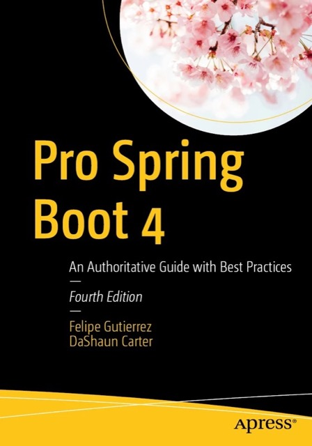
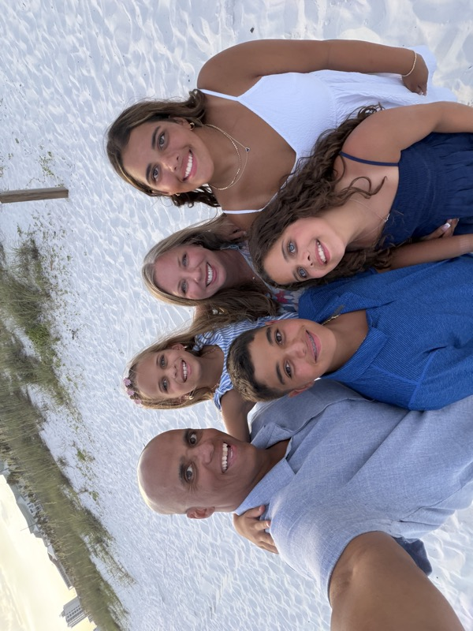

<!-- .slide: data-background-color="#6db33f" -->

# Engineering Autonomous Agents

### From Prompting to Digital Workers with Embabel and Spring

DaShaun Carter | Spring Developer Advocate

[DaShaun.com](https://dashaun.com)

Notes:
Good morning, I'm DaShaun Carter.
I'm a Spring Developer Advocate. I love my job, and I'm jazzed to be here.

Pre-flight (run before going on stage)
- Ensure you have JDK 21+, Spring Boot 4.1, Spring AI 2.0, and Embabel 1.0.0-RC1
- Have your IDE open to labs/digital-worker
- Run ./mvnw test before participants arrive

Running this deck
- jwebserver -d docs -p 8000 — JDK 21+ built-in static server
- Open http://localhost:8000 in presenter window (press S for speaker notes)

Reveal.js shortcuts
- S — speaker view (notes + next slide + timer)
- B — black out screen
- F — fullscreen
- Esc — slide overview
- Down/Up — move inside the current module
- Right/Left — jump between Intro, Warmer, Part 1, Part 2, and Outro

Likely questions:
- Q: Is this a follow-up to the companion presentation? A: Yes. The talk introduced the architecture; this workshop rebuilds the SRE worker step by step.
- Q: Why Java 21 when the abstract says JDK 17+? A: Spring Boot 4.1 supports Java 17, but the published Embabel 1.0.0-RC1 API is Java 21 bytecode.
- Q: Can I navigate directly to a lab section? A: Yes. Press Esc for the two-dimensional overview, then choose a horizontal module and a vertical slide.

---

## Now We Are Connected

### [DaShaun.com](https://dashaun.com)

Slides, code, events, and every social link live there.

Notes:
Keep this to 20 seconds. It gives participants one durable place to find the updated materials after the event.

Likely questions:
- Q: Where will the finished code and slides live? A: DaShaun.com links to the repository and event materials.
- Q: Can participants use the completed code during the lab? A: Yes. The repository remains green at checkout so anyone can recover quickly.

---

### [SpringOfficeHours.io](https://springofficehours.io)

Notes:
Brief personal connection only; do not spend workshop time explaining the show.

Likely questions:
- Q: Is there a place to ask follow-up Spring questions? A: Spring Office Hours and the Spring community channels are good follow-up paths.

---

Notes:
This establishes why the version contract matters to the presenter: Spring Boot 4 is not incidental branding in this workshop.

Likely questions:
- Q: Is Spring Boot 4.1 required or can I use 4.0? A: The lab is intentionally pinned to 4.1.0 to match the workshop and companion presentation. Porting is a separate exercise.

---

Notes:
Use this as the human close to the personal introduction, then move immediately to the warmer with Right Arrow.

Likely questions:
- Q: Why include this in a technical workshop? A: It is the same personal introduction as the companion presentation and keeps the workshop voice consistent.
